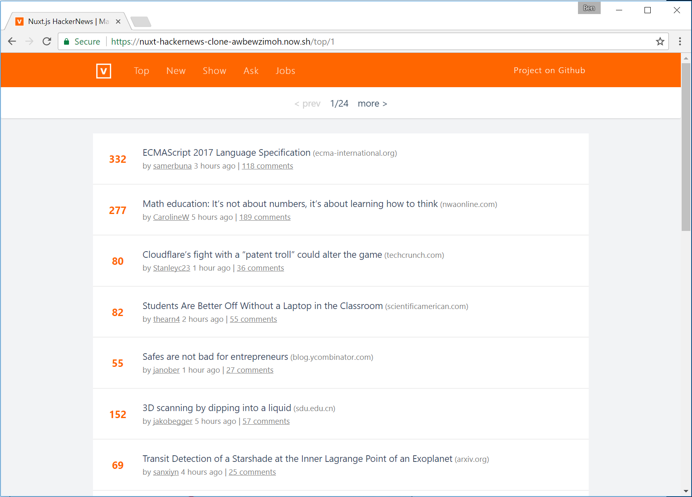
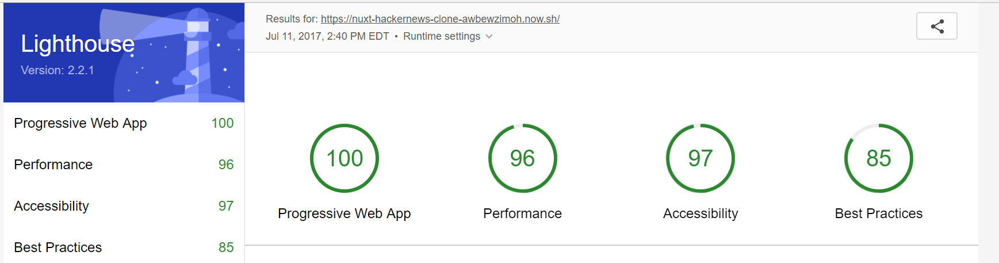

# nuxt-hackernews-clone

An experiment with Vue.js and Nuxt.js. This project is a port of Vue HN 2.0 (https://github.com/vuejs/vue-hackernews-2.0) to Nuxt.js (https://nuxtjs.org/).



## Todo List

- [x] Register a Service Worker
- [x] Respond with 200 when offline
- [x] Configure custom splash screen
- [x] Themed address bar



## Build Setup

``` bash
# install dependencies
$ npm install # Or yarn install

# serve with hot reload at localhost:3000
$ npm run dev

# build for production and launch server
$ npm run build
$ npm start

# generate static project
$ npm run generate
```

For detailed explanation on how things work, checkout the [Nuxt.js docs](https://github.com/nuxt/nuxt.js).
